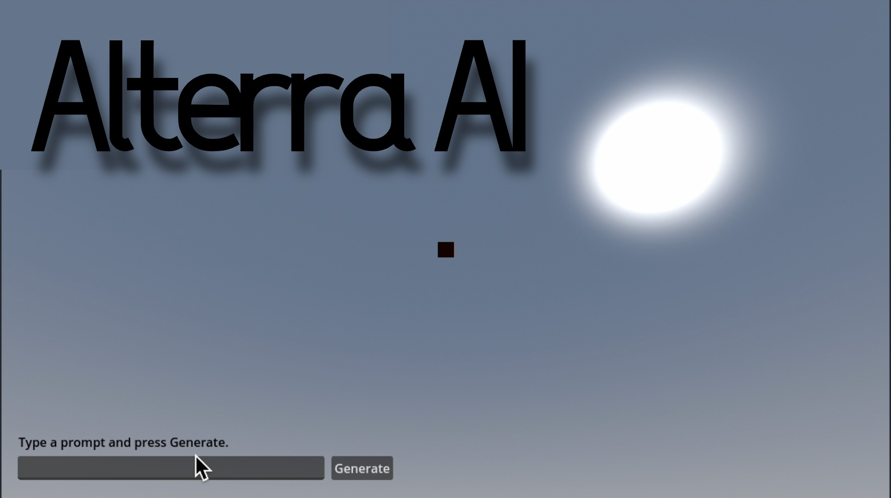

# Alterra AI

Alterra is a local AI system that transforms natural-language historical and counterfactual prompts into interactive 3D worlds. It bridges LLM's with real-time game engines by converting non-deterministic AI output into structured, validated scene data consumable by the Godot Engine.

The project focuses on system design, validation, and runtime safety rather than visual fidelity.

## Architecture Overview

### 1. Prompt to World Specifications
- User submits a prompt (e.g. *"What if Rome never fell?"*)
- A local LLM (Llama 3.1 via Ollama) generates a structured world description and creates landmarks associated with historical descriptions

### 2. Validation & Normalization
- Output is validated against a strict JSON schema
- Coordinates, units, and metadata are normalized
- Invalid generations are rejected before reaching the engine

### 3. Real-Time 3D Execution
- Godot processes the validated scene data
- A GDScript runtime dynamically spawns:
  - Appropriate terrain based on the user's prompt
  - Landmarks
  - World objects

## Tech Stack

- Python — AI pipeline and schema validation
- Ollama (Llama 3.1) — Local LLM 
- Godot Engine — Real-time 3D runtime
- GDScript — Scene execution and regeneration
- JSON Schema — Validation layer

## Next Steps

Future extensions include:
- Semantic building and city layouts
- Physics-aware terrain constraints
- Asynchronous background generation
- Swappable geometry layers for richer assets

## Project Goal

Alterra is not a game.

Its an exploration of how generative AI can be safely integrated into a production-scale interactive environment while preserving determinism, stability, and developer control.
